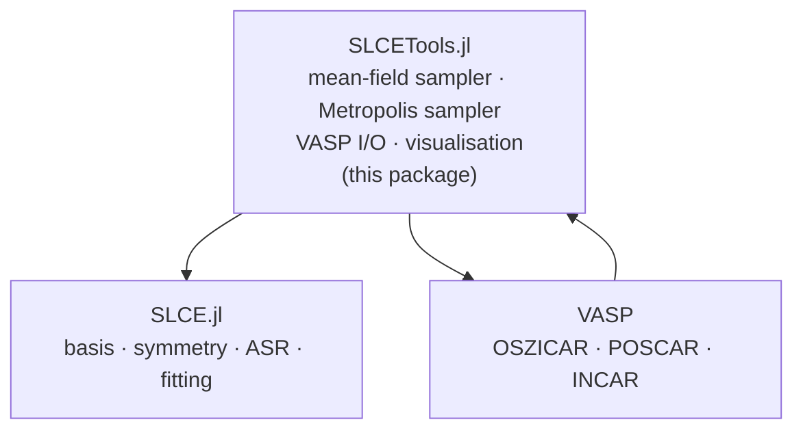
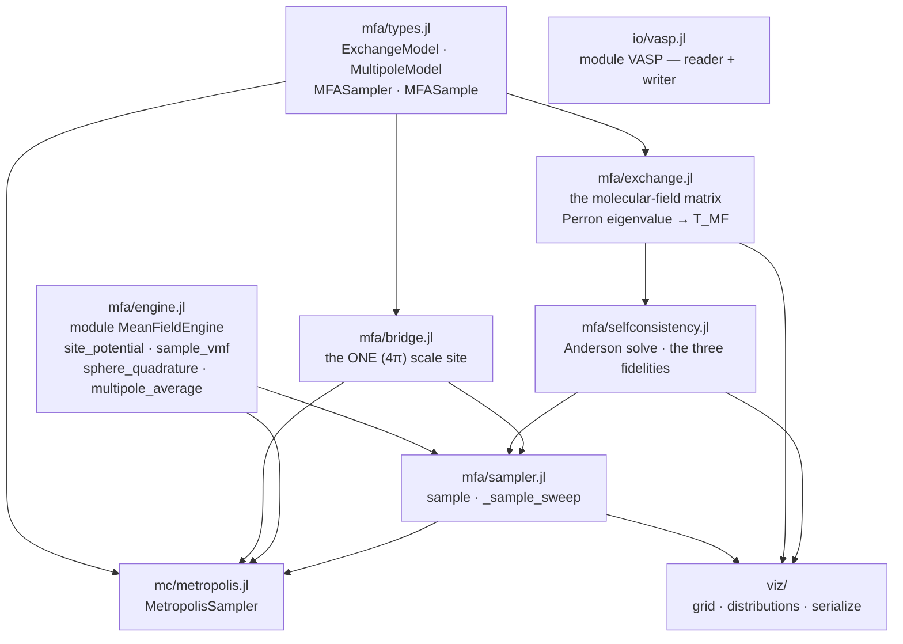

# Architecture and reading order — SLCETools.jl

This file answers one question: **coming back to this code, what do I read, in what
order, and how do the pieces depend on each other?**

Neighbours that cover the rest:

| For | Read |
|---|---|
| What the public API *is*, and the planned active-learning layer | [`SPEC.md`](SPEC.md) |
| Which files must change together, and the gate that proves it | [`CLAUDE.md`](CLAUDE.md) § "Coupled code sites" |
| The mean-field sampler design (D1–D5, P0–P4) | [`docs/specs/mfa-sampling.md`](docs/specs/mfa-sampling.md) |
| Naming | [`STYLE_GUIDE.md`](STYLE_GUIDE.md) |
| The family-wide data flow | [`../SLCE.jl/ARCHITECTURE.md`](../SLCE.jl/ARCHITECTURE.md) § 5 |

---

## 1. Where this package sits



An arrow **A → B** reads "A depends on B" (or, for the VASP arrows, "data flows this
way"). This package **consumes** a fitted model; it never builds one. It closes the
active-learning loop: read DFT output → fit (upstream) → sample configurations →
write DFT input.

It does **not** depend on SLCEMonteCarlo, even though both do Metropolis. The
distinction is scope: this package samples *configurations* on the single training
cell; SLCEMonteCarlo does thermodynamics-grade runs on a supercell with error bars.

**What it reads from SLCE** — public introspection only, never the SALC internals:
`spin_multipole_terms`, `bilinear_terms`, `n_atoms`, `SLCE.Harmonics`, `spin_datum`,
`Crystal` / `Lattice` / `TrainingDatum` / `AbstractDFTSource`, and `KB_EV` /
`resolve_kt` (borrowed, never re-defined).

**Third-party**: none beyond stdlib. The JSON the viewer consumes is written by a
hand-rolled emitter.

---

## 2. Internal layering

Include order in `src/SLCETools.jl`:

```
mfa/engine.jl        (submodule MeanFieldEngine — the parent re-binds names immediately)
mfa/types.jl · mfa/exchange.jl · mfa/selfconsistency.jl · mfa/sampler.jl · mfa/bridge.jl
mc/metropolis.jl
io/vasp.jl           (submodule VASP)
viz/{grid, distributions, serialize}.jl
```



### Include positions that are load-bearing

- `mfa/engine.jl` first — the parent module does `using .MeanFieldEngine: …`
  immediately after including it.
- `mfa/types.jl` before everything that annotates its types or subtypes
  `AbstractSampler`.
- **`mfa/selfconsistency.jl` before `viz/distributions.jl`** — a `const` there is
  computed from a self-consistency constant **at load time**, so this is a real
  ordering constraint and not a stylistic one.
- `viz/grid.jl` → `viz/distributions.jl` → `viz/serialize.jl`.

No layering violations: every name is defined before first use.

Two structural notes worth knowing before editing:

- `src/mc/` is described as a future extraction seam, but it currently depends on
  three `mfa/` files. The seam is not clean today.
- `viz/distributions.jl` reaches into several `mfa/` privates — the widest private
  surface in the package.

---

## 3. Reading order

About an hour. Half the package by volume is the VASP adapter, which is
self-contained and can wait.

| # | File | What it establishes | Key names |
|---|---|---|---|
| 1 | `src/SLCETools.jl` | The consume-only contract and the two export tiers | — |
| 2 | `src/mfa/engine.jl` | The entire single-site physics, in one dependency-free submodule | `site_potential`, `sample_vmf`, `sample_site_metropolis`, `multipole_average` |
| 3 | `src/mfa/types.jl` | Every struct and its invariants. **The inner constructors are the specification** | `ExchangeModel`, `MultipoleModel`, `MFASampler` |
| 4 | `src/mfa/exchange.jl` | The header derives `T_MF = ρ/3` and the reduced temperature `τ` — read the prose | `_mfa_matrix`, `_perron`, `_molecular_field` |
| 5 | `src/mfa/selfconsistency.jl` | The three fidelities (closed-form vMF, tensorial, multipole) behind one Anderson driver | `_anderson_solve`, `_coupled_state`, `_multipole_state` |
| 6 | `src/mfa/sampler.jl` | How a user call routes to one of those fidelities | `sample`, `_sample_sweep`, `mfa_temperature_scale` |
| 7 | `src/mfa/bridge.jl` | The only place a fitted `SLCEModel` is touched, and the package's **single** `(4π)^(body/2)` application site | `_scaled_multipole_terms`, `MultipoleModel(model)` |
| 8 | `src/mc/metropolis.jl` | The joint-Boltzmann sibling of the mean-field sampler: absolute temperature, exact local ΔE | `MetropolisSampler`, `_mc_sweep!` |

### Safe to skip on a first pass

- `src/io/vasp.jl` — **half the package by line count**, and a self-contained format
  adapter with zero coupling to the samplers. Read it when you touch DFT I/O; then
  read all of it, because the reader and the writer are inverse-consistent by
  construction (one SAXIS rotation serves both, and the POSCAR atom ordering is
  shared).
- `src/viz/{grid,distributions,serialize}.jl` — export plumbing for the Python
  sphere viewer.
- the Gauss–Legendre helper inside `mfa/engine.jl` — standard quadrature.

---

## 4. Entry points and where the work happens

```
MFASampler(model::SLCEModel)           mfa/bridge.jl
 └─ MultipoleModel(model)
      ├─ _scaled_multipole_terms       ← SLCE.spin_multipole_terms, (4π)^(body/2) HERE
      └─ ExchangeModel(bilinear)       ← SLCE.bilinear_terms
 └─ MFASampler(::MultipoleModel)       mfa/sampler.jl
      └─ _mfa_matrix → _perron         mfa/exchange.jl — sets T_MF

sample(::MFASampler, n)                mfa/sampler.jl
 └─ _sample_sweep
      ├─ closed-form path   → _coupled_state    selfconsistency.jl
      │                     → sample_vmf        engine.jl
      └─ Metropolis path    → sample_site_metropolis → site_potential

MetropolisSampler(model) / sample      mc/metropolis.jl → _mc_sweep!
VASP.read_configs(::Oszicar)           io/vasp.jl → SLCE.spin_datum → TrainingDatum
VASP.write_inputs                      io/vasp.jl → write_poscar + write_incar
write_mfa_distributions                viz/serialize.jl → mfa_site_coefficients
```

Three things worth remembering rather than re-deriving:

- **`τ = T/T_MF` is a reduced temperature, and the Metropolis sampler deliberately is
  not on that axis** — it takes an absolute temperature, because a model need not
  have a bilinear channel for `T_MF` to exist.
- **The `(4π)^(body/2)` scale is applied exactly once**, in `mfa/bridge.jl`. Anything
  downstream that re-applies it double-counts.
- **Absent is not zero**: an OSZICAR with no constraining-field block yields
  `field = nothing`, never a fabricated zero field — a zero field would claim that a
  vanishing torque was *observed*.
